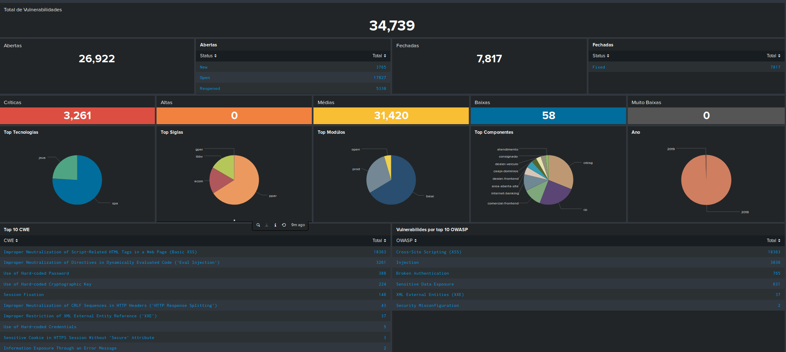
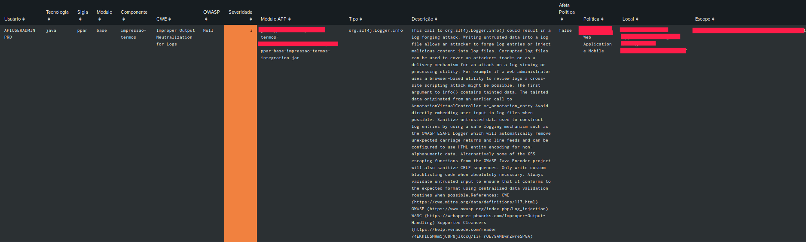

# Veracode to Splunk or ELK

This script takes all the information vera code provides for SAST / DAST scans. Generating an output to be indexed in your Splunk or ELK.

## Info:

Outputs XML and Json, contain all API content, whereas CSV has only fields that I consider important.

## Install

```
git clone https://github.com/andreyglauzer/veracode-to-splunk.git
cd veracode-to-splunk
pip install -r requirements.txt
```

## Use:

```
python veracode-to-splunk.py --config utils/config.yml --output csv
```

## Examples

<p align="center">
  
</p>
<p align="center">
  
</p>
